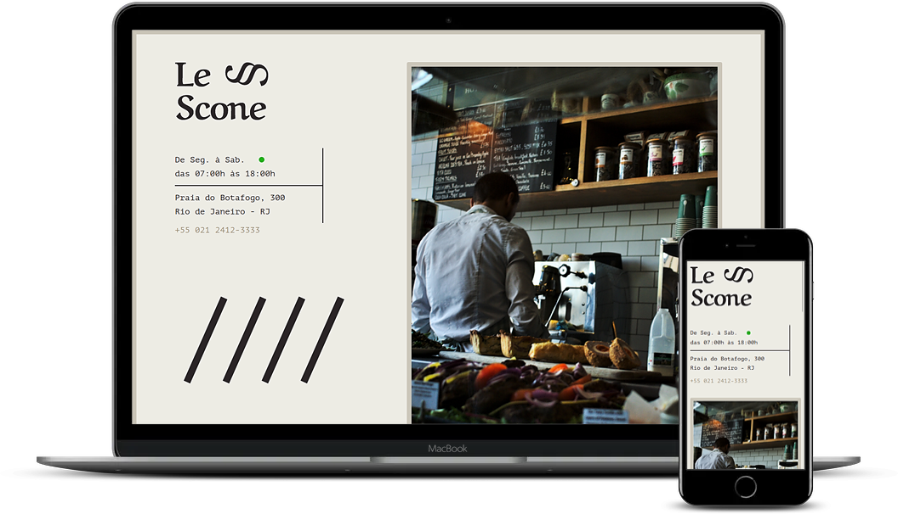

# le-scone
Le Scone is a project developed during the Origamid CSS with SASS course, utilizing advanced Sass features such as variables, mixins, functions, conditionals, and more.

You can access the project by clicking [here!](https://brunaa-f.github.io/le-scone/)
